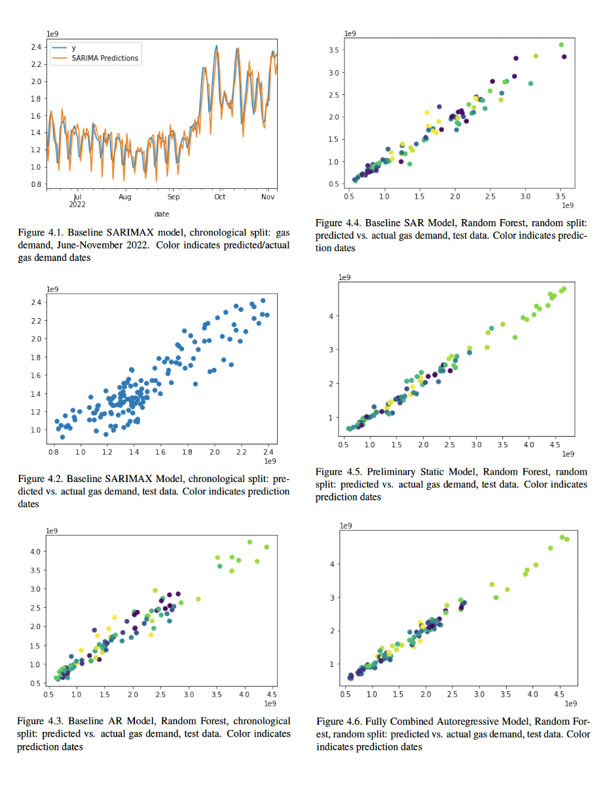

```{r setup, include=FALSE}
knitr::opts_chunk$set(echo = FALSE)

# Load dependencies 
library(reticulate) # For rendering Python code 
```

```{r eval = TRUE, echo = FALSE, out.width = '100%'}


```


## Outline 

-	Predicting gas demand is one of the most crucial tasks for the German government 
-	Modelling gas demand is highly complex given its dependence on various Supply-side factors (heating vs electricity; industrial vs residential)
-	Many of these factors are inter-dependent; for e.g. gas prices, exports, GDP
-	Demand side factors such as ’responsible demand usage’ further influence gas demand
-	In the past academic literature on modelling gas demand has been mostly reliant upon seasonality and less responsive to these immediate Demand and Supply (D-S) side shocks
-	We use a combination of Auto Regressive and Random Forest models to capture both long term seasonal as well as short term D-S shocks


## Introduction / Background

The Russia-Ukraine war has lead Europe towards the largest energy crisis since the oil price shock of 1973. Since mid-2021, natural gas prices have been on a steep rise, with average wholesale prices at the TTF spot market well above 100 C/MWh between October 2021 and mid-2022 and prices of around 240 C/MWh in August. This is about ten times higher than the long-term pre-Covid price levels of 15–20 C/MWh (Ruhnau et al 2022).

Germany is an interesting case study to explore gas demand, as it is the largest export market for Russian natural gas. Furthermore, natural gas plays an essential role in Germany’s industrial production as well as space heating. Reductions in Germany can therefore make a substantial contribution to solving the crisis at a European level. In order to effectively reduce the amount of gas demanded, it is crucial to have some foresight into how much gas will be demanded in the future. To that end, we will aim to predict daily German gas demand by implementing a variety of Machine Learning models.


## Our Approach 

Existing research on energy demand prediction mostly makes use of classical, econometric autoregressive modelling techniqes and only sparsely incorporate machine learning methods. Much of the literature concerning the forecast of gas demand applies Time Series (TS) models (Zhang, 2020).

We make use of a combination of models and by splitting the test-train data both randomly and chronologically, we assess their strengths. Below is a quick summary of these: 

i.	Static models that use a variety of predictive variables including weather and economic factors. They also function well as benchmark models for comparative purposes

ii.	Autoregressive Integrated Moving (ARIMA) models used to convert a non-stationary time series into a stationary one, and then predict future values from historical data. These models are good short term predictors but poor long term forecasting models i.e. not ideal for identifying unprecedented events. 

iii.	Auto Regressive (AR) models are a special case of the more general ARIMA models of time series, which have a more complicated stochastic structure. It specifies that the output variable depends linearly on its own previous values and on a stochastic term.

iv.	Seasonal Autoregressive Integrated Moving Average with exogenous factors, or SARIMAX, is an extension of the ARIMA class of models. Unlike the ARIMA, it can capture seasonality in the model. This enables it to provide qualified annual forecasting for demand of gas.

v.	Stochastic Gradient Descent (SGD) because of their ability to cope with large-scale datasets;

vi.	Random Forests (RF) as an ensemble learning method, because it works particularly well when having a large number of correlated predictors.

vii.	Combinations of the above


## Data we used

We compiled a dataset consisting of 1833 daily observations (roughly 5 years) and 510 predictor variables, including transformations. For all variables, including date transformations, we add ln, square and elasticity transformations. Additionally, a 7-day lagged copy of all variables except date features is added. Our key variables were;  Daily national gas demand, Gas prices, Weather data from various cities within Germany, Co2 Prices, Electricity Prices, DAX and Quarterly GDP. 


## Key Findings

*Our key findings are summarized below:*

- As demand can be predicted using weather and economic data; the proof-of-concept Linear SGD Model
with chronological split performs with R2 = 0.9039, 
- Gas demand is strongly autocorrelated; when building simple AR models, the best model is a Random Forest with random split, performing with R2 = 0.9446,
- Seasonal patterns matter; when extending to SAR models, the best model is a Random Forest with random
split, performing with R2 = 0.9644,
- Machine Learning models win over classical econometrical models; the SARIMAX model with chronological
split performs with R2 = 0.8150, confirming that there is strong autocorrelation in place in any case.
- The best model is a Random Forest with random split, performing with R2 = 0.9794. When comparing RMSE values, it outperforms the preliminary model.

*More generally, we find:*

- In almost all model configurations, Random Forest models outperform Linear SGD models,
- Our combination strategy works: pairing autoregressive and machine learning modeling approaches increases the predictive strength. The SAR ML models with full variable configuration do the trick and are
able to catch the underlying principles of gas demand.

Below you can find a visual representation of the fit of some of the models we used. 


```{r eval = TRUE, echo = FALSE, out.width = '100%', fig.cap = "Snapshot from our Research paper on the various models used"}

```

